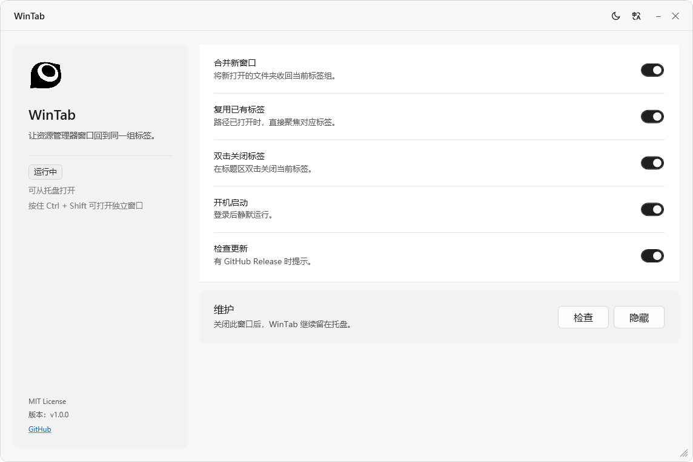

<div align="center">

  

  <h1>WinTab</h1>

  <p>File Explorer tab utility for Windows 11</p>

  <p><a href="README.md">简体中文</a> | English</p>

  <p>
    
    
    
  </p>
</div>

---



## Features

- Merge newly opened File Explorer windows
- Reuse tabs for paths that are already open
- Close the current tab by double-clicking the tab title
- Hold `Ctrl + Shift` for a separate Explorer window
- System tray runtime
- Chinese and English UI
- Light / dark themes
- Startup registration
- GitHub Release update checks

## Download

Pick the installer that matches your CPU architecture ([Releases](https://github.com/OUBIGFA/WinTab/releases)):

- `WinTab_v1.0.0_x64_Setup.exe` — 64-bit Intel/AMD (most users)
- `WinTab_v1.0.0_arm64_Setup.exe` — ARM64 Windows (Surface Pro X, Snapdragon laptops)
- `WinTab_v1.0.0_x86_Setup.exe` — 32-bit Windows

## Requirements

- Windows 11 22H2 or newer
- .NET 9 Desktop Runtime (the installer downloads it on first run if missing)

## Project Structure

```text
WinTab/
├── .github/
├── Assets/
├── installers/
├── WinTab/
├── build.ps1
├── LICENSE
├── README.md
├── README.en.md
└── WinTab.sln
```

## Settings

```text
%APPDATA%\WinTab\settings.json
```

## Development

This project uses `SHDocVw` / `Shell32` COM references and must be built with Visual Studio MSBuild. `dotnet build` fails because the .NET Core MSBuild path does not support `ResolveComReference`.

```powershell
# Publish one architecture
.\build.ps1 -Arch x64 -SkipInstaller

# Build the solution and the console self-check project
MSBuild.exe WinTab.sln /restore /t:Build
WinTab.Tests\bin\Debug\net9.0-windows\WinTab.Tests.exe
```

## Acknowledgements

- [ExplorerTabUtility](https://github.com/w4po/ExplorerTabUtility)

## License

MIT License
