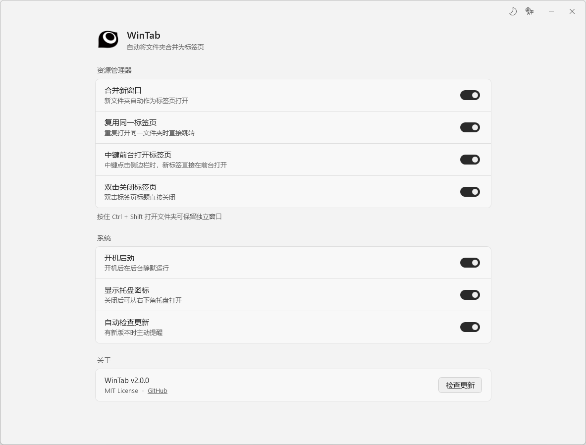

# WinTab

File Explorer tab utility for Windows 11

[简体中文](README.md) | English

  

WinTab is a Windows 11 utility that brings a single-window, multi-tab experience by automatically merging newly opened File Explorer windows into the active window as tabs, with path deduplication, double-click to close, independent window retention via Ctrl+Shift, and system tray operation for more efficient file management.

---

## Features

- One window, multiple tabs: automatically merge new File Explorer windows into active tabs
- Reuse opened tabs instead of opening duplicates
- Optionally restore the last closed window's tab group, with a separate opt-in for single-tab windows (off by default)
- Open middle-clicked folders in the foreground, whether clicked in the navigation pane, the file list or Home
- Double-click tab titles to close tabs
- Hold `Ctrl + Shift` while opening folders to keep a separate window
- System tray background runtime

## Restore last tab group

Enable **Restore last tab group** in settings (off by default). WinTab saves the last closed window's tab group, not every previously closed window. **Restore single-tab windows** is a separate option and is off by default: only windows with two or more tabs are saved and restored, and closing a single-tab window does not replace the saved group. Enable it to save and restore single-tab windows too.

Restoration can only trigger in a newly opened window when no other File Explorer windows are open. It works independently of **Merge new windows**:

- **Normal launch only (default)**: restore on a normal launch to Home, This PC or the start folder chosen in File Explorer's options. Opening a specific folder does not trigger restoration.
- **Any folder**: always keep the initial tab active and append the saved tabs after it. Home, This PC and custom start locations opened from the taskbar are kept too, never closed.

Torn-off windows, separate windows opened with `Ctrl + Shift`, and windows already open when the feature is enabled or WinTab starts do not trigger restoration. Folders that no longer exist, network locations and unsupported locations are skipped; built-in pages such as Recycle Bin and Gallery are restored. Switching windows, switching tabs or browsing elsewhere during restoration stops it immediately, and so does a system that cannot create tabs in the background; the folder you opened is never affected.

## Diagnostic logs

WinTab records diagnostic logs by default; no setup is needed. Files are stored in `%LOCALAPPDATA%\WinTab\logs\` as `WinTab-yyyyMMdd.log`. Only today's and yesterday's logs are kept. Each file is limited to 8 MiB with one `.1.log` rollover file, bounding the two days to about 32 MiB in total.

If a middle-click does not activate its tab or restoration behaves unexpectedly, check the matching time for click outcomes, cancellation reasons and restoration stages. Review folder paths and other details before sharing logs. Writing happens in the background through a bounded queue; consecutive duplicate entries are collapsed into a count.

## Download

Pick the installer that matches your CPU architecture ([Releases](https://github.com/OUBIGFA/WinTab/releases)):

- `WinTab_<version>_x64_Setup.exe` — 64-bit Intel/AMD (most users)
- `WinTab_<version>_arm64_Setup.exe` — ARM64 Windows (Surface Pro X, Snapdragon laptops)
- `WinTab_<version>_x86_Setup.exe` — 32-bit Windows

## Requirements

- Windows 11 22H2 or newer
- .NET 9 Desktop Runtime (the installer downloads it on first run if missing)

## License & Acknowledgements

Released under the MIT License.

Portions of the source code are derived from [ExplorerTabUtility](https://github.com/w4po/ExplorerTabUtility) (Copyright (c) w4po, MIT License). See [THIRD-PARTY-NOTICES.md](THIRD-PARTY-NOTICES.md) for attribution and the full license text.
