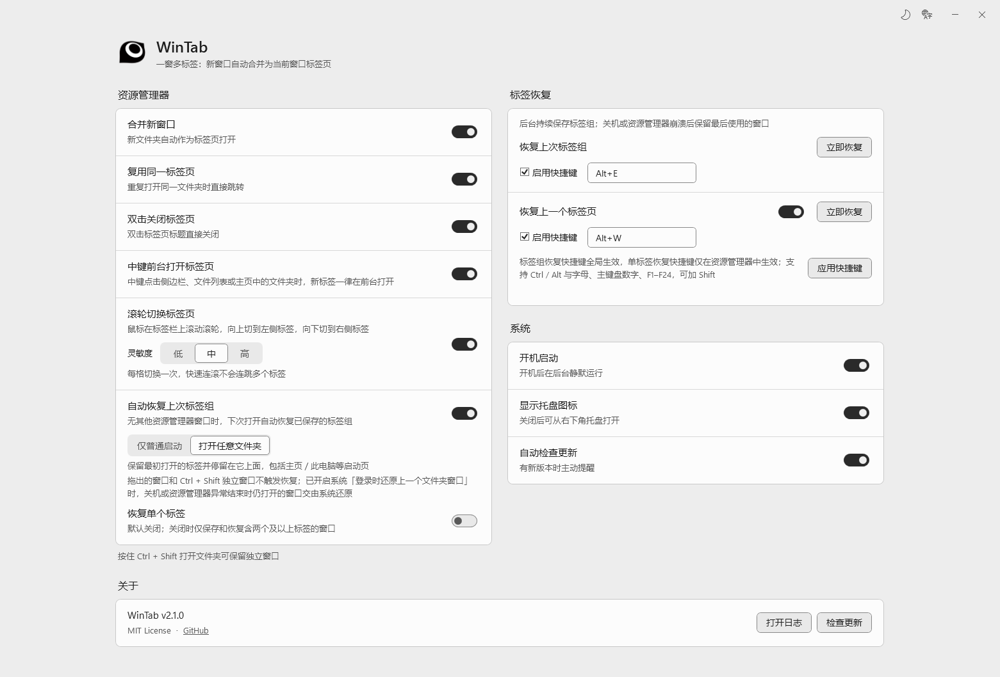

# WinTab

Windows 11 文件资源管理器标签页工具

简体中文 | [English](README.en.md)

  

WinTab 是一款 Windows 11 工具，实现「一窗多标签」：自动将新打开的资源管理器窗口合并为当前窗口的标签页，支持路径去重、双击关闭、独立窗口保留和托盘后台运行，让文件管理更整洁高效。

---

## 功能

- 一窗多标签：自动将新打开的资源管理器窗口合并为当前窗口标签页
- 复用同一标签页，避免重复打开相同文件夹
- 持续保存标签组，支持关机／崩溃后恢复、手动恢复标签组与最近关闭标签页
- 中键前台打开标签页（在侧边栏、文件列表或主页中中键点击文件夹时一律在前台打开）
- 双击标签页标题直接关闭
- 按住 `Ctrl + Shift` 打开文件夹可保留独立窗口
- 托盘后台静默运行与开机启动

## 恢复上次标签组

WinTab 运行时持续记录标签组，只恢复最近使用的一个窗口：正常关闭保存最后关闭的窗口，关机或崩溃后恢复最后使用窗口的最近记录。「恢复单个标签」默认关闭，此时仅记录含两个及以上标签的窗口，关闭单标签窗口不覆盖已保存的组。

托盘的「标签恢复」功能区和设置页均提供：

- **恢复上次标签组**：在新窗口中恢复标签组，保留标签顺序与原活动标签。快捷键 `Alt+E`，全局生效。
- **恢复上一个标签页**：恢复最近关闭的标签，优先使用当前窗口。默认开启，快捷键 `Alt+W`，仅资源管理器前台生效；最近 25 个关闭记录仅保留到本次运行结束。

两者都可在设置页单独关闭或改键。路径记录保存在 `%APPDATA%\WinTab\session.json` 及其备份，请按个人文件夹信息保护。

### 自动恢复（可选）

「自动恢复上次标签组」默认关闭。开启后仅在没有其他资源管理器窗口时，由新打开的窗口触发：

- **仅普通启动（默认）**：从主页、此电脑或设定的启动位置启动时恢复。
- **打开任意文件夹**：保留最初打开的标签，并在其后补回历史标签。

拖出的窗口、`Ctrl + Shift` 独立窗口和开启此功能时已存在的窗口不触发恢复；缺失或不支持的位置会跳过。恢复中切换窗口或标签即停止。

## 诊断日志

WinTab 默认记录运行与操作日志，无需手动开启。日志位于 `%LOCALAPPDATA%\WinTab\logs\`，按日期命名为 `WinTab-yyyyMMdd.log`，仅保留今天和昨天。单文件最多 8 MiB，超限滚动保留一个 `.1.log` 文件，两天合计最多约 32 MiB。

遇到中键未激活或恢复异常时，可按发生时间查看点击结果、取消原因和恢复阶段；分享日志前请检查其中的目录路径等信息。日志在后台写入，队列有上限，连续相同记录会合并计数。

## 下载

根据 CPU 架构选择对应安装器（[Releases](https://github.com/OUBIGFA/WinTab/releases)）：

- `WinTab_<版本>_x64_Setup.exe` — 64 位 Intel/AMD（大多数用户）
- `WinTab_<版本>_arm64_Setup.exe` — ARM64 Windows（Surface Pro X 等）
- `WinTab_<版本>_x86_Setup.exe` — 32 位 Windows

## 系统要求

- Windows 11 22H2 或更高版本
- .NET 9 Desktop Runtime（首次运行安装器会自动下载安装）

## 许可与致谢

本项目以 MIT License 发布。

部分源代码派生自 [ExplorerTabUtility](https://github.com/w4po/ExplorerTabUtility)（Copyright (c) w4po，MIT License）。相关归属与许可全文见 [THIRD-PARTY-NOTICES.md](THIRD-PARTY-NOTICES.md)。
